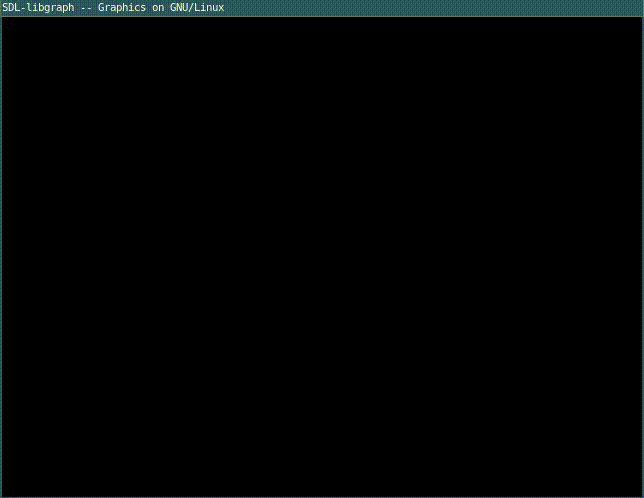

# Boundary Fill

1. `codigo.c`

	```c
	#include<graphics.h>
	void bf(int x,int y,int bc,int fillc){
	    // pixel color should not be equal to background color
	    // And if it is already fill color, no need to fill it again
		if(getpixel(x,y) != bc && getpixel(x,y) != fillc){
		// Fill that pixel
		putpixel(x,y,fillc);
		bf(x+1,y+1,bc,fillc);
		bf(x+1,y-1,bc,fillc);
		bf(x-1,y+1,bc,fillc);
		bf(x-1,y-1,bc,fillc);
		bf(y+1,x+1,bc,fillc);
		bf(y+1,x-1,bc,fillc);
		bf(y-1,x+1,bc,fillc);
		bf(y-1,x-1,bc,fillc);
		}
	}
	int main(){
		int gd = DETECT, gm;
		initgraph (&gd, &gm, "");
		setcolor(RED);
		// Circle 1
		circle(200,200,150);
		circle(200,200,151);
		circle(200,200,152);
		// Circle 2
		circle(200,200,100);
		circle(200,200,101);
		circle(200,200,102);
		bf(200,200,4,14);
		bf(320,200,4,15);
		delay(50);
		getch();
		return 0;
	}
	```

2. Compilar y ejecutar

	```sh
	$ gcc codigo.c -lgraph
	$ ./a.out
	```

3. Resultado

	
