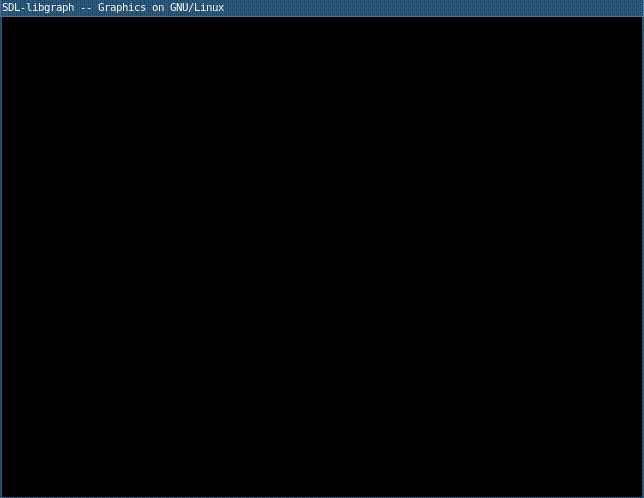

# Fern Leaf

1. `codigo.c`

	```c
	#include<math.h>
	#include<graphics.h>
	#define PI 3.142
	int a;
	void drawfern(int x,int y,int l,int ang,int n){
	    int x1,y1,i,l1,xpt,ypt,lpt;
	    double t=ang*PI/180;
	    if(n>0){
		//calculate x1,y1,l1
		x1=(int)(x - l*sin(t));
		y1=(int)(y - l*cos(t));
		l1=(int)(l / 5);
		//draw branch
		line(x,y,x1,y1);
		setcolor(GREEN);
		//draw its 5 branches
		for(i=1; i<=5; i++){
		    xpt=(int)( x - i*l1*sin(t));
		    ypt=(int)(y - i*l1*cos(t));
		    lpt=(int)(l/(i+2));
		    drawfern(xpt,ypt,lpt,ang+a,n-1);
		    drawfern(xpt,ypt,lpt,ang-a,n-1);
		}
	    }
	}
	int main(){
	    int x,y,l;
	    int gd = DETECT, gm;
	    initgraph (&gd, &gm, "");
	    x=getmaxx()/2;
	    y=getmaxy();
	    l=400; //length of branch
	    a=50;  //angle for leaves
	    setcolor(BROWN);
	    //n is the depth of branch
	    drawfern(x,y,l,0,5);
	    getch();
	    return 0;
	}
	```

2. Compilar y ejecutar

	```sh
	$ gcc codigo.c -lgraph -lm
	$ ./a.out
	```

3. Resultado

	
