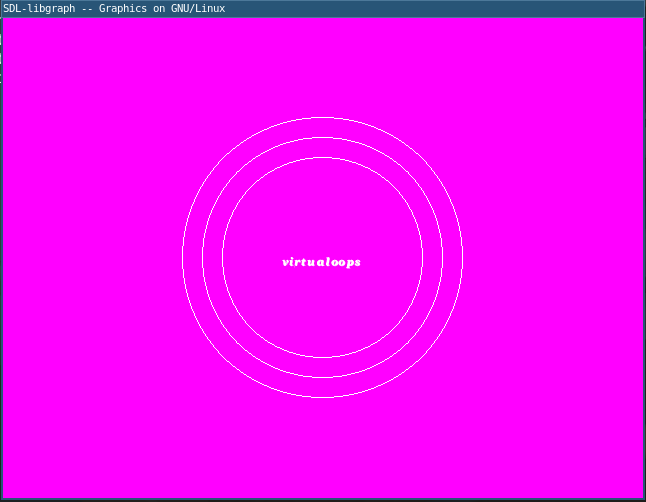

# [GRAPHICS](https://github.com/SagarGaniga/Graphics-Library)

## Instalación

1. Dependencias principales

	```sh
	$ sudo apt install libsdl-image1.2 libsdl-image1.2-dev libsdl1.2-dev
	$ sudo apt install guile-2.2-dev guile-2.2 libesd-java
	```

3. Clonar

	```sh
	$ wget http://download.savannah.gnu.org/releases/libgraph/libgraph-1.0.2.tar.gz
	$ sudo tar -xvzf libgraph-1.0.2.tar.gz
	$ cd libgraph-1.0.2
	$ CPPFLAGS="$CPPFLAGS $(pkg-config --cflags-only-I guile-2.2) -fcommon" \
		CFLAGS="$CFLAGS $(pkg-config --cflags-only-other guile-2.2) -fcommon" \
		LDFLAGS="$LDFLAGS $(pkg-config --libs guile-2.2)" \
		./configure
	$ make
	$ sudo make install
	$ sudo cp /usr/local/lib/libgraph.* /usr/lib
	```

## Compilar y ejecutar

```sh
$ gcc codigo.c -lgraph
$ ./a.out
```

## Funciones

|Funciones|Descripción|
|--------|-----------|
|setbkcolor(5)|color de fondo rosado|
|cleardevice()|limpiar pantalla|
|closegraph()|cerrar ventana|
|getmaxy(), getmaxy()|maximo tamaño de ventana|
|outtextxy(100,100,"virtualoops")|texto|
|putpixel(100,100,WHITE)|punto|
|line(10,10,100,100)|linea|
|circle(50,50,100)|circulo|

## lineas

1. `codigo.c`

	```c
	#include<graphics.h>
	int main(){
		int gd=DETECT,gm;
		initgraph(&gd,&gm,NULL);
		line(100,100,300,300);
		delay(2000);
		cleardevice();
		line(10,10,100,100);
		delay(2000);
		closegraph();
		return 0;
	}
	```

2. Compilar y ejecutar

	```sh
	$ gcc codigo.c -lgraph
	$ ./a.out
	```

3. Resultado

	

## Círculos

1. `codigo.c`

	```c
	#include <graphics.h>
	int main(){
		int gd=DETECT,gm;
		initgraph(&gd,&gm,NULL);
		setbkcolor(5);
		cleardevice();
		circle(getmaxx()/2,getmaxy()/2,100);
		circle(getmaxx()/2,getmaxy()/2,120);
		circle(getmaxx()/2,getmaxy()/2,140);
		outtextxy(getmaxx()/2-40,getmaxy()/2,"virtualoops");
		delay(10000);
		return 0;
	}

	```

2. Compilar y ejecutar

	```sh
	$ gcc codigo.c -lgraph
	$ ./a.out
	```

3. Resultado

	

## Función seno

1. `codigo.c`

	```c
	#include <graphics.h>
	#include <math.h>
	int main(){
		int gd=DETECT,gm;
		initgraph(&gd,&gm,NULL);
		setbkcolor(5);
		line(0,300,getmaxx(),300);
		int x,y;
		float pi=3.1415;
		for(int i=-360;i<=360;i++){
			x=400+i;
			y=300-sin(i*pi/100)*25;
			putpixel(x,y,WHITE);
		}
		delay(3000);
		return 0;
	}
	```

2. Compilar y ejecutar

	```sh
	$ gcc codigo.c -lgraph -lm
	$ ./a.out
	```

3. Resultado

	
