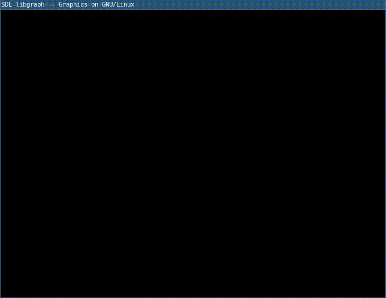

# Triángulo de Serpenski

1. `codigo.c`

	```c
	#include<graphics.h>
	void drawtriangle(int x1, int y1, int x2, int y2, int x3, int y3){
		if(x1-x2 > 1){
		line(x1,y1,x2,y2);  //12
		line(x2,y2,x3,y3);  //23
		line(x3,y3,x1,y1);  //21
		//Recursion
		// x1 and y1 dominating
		drawtriangle(x1,y1,(x1+x2)/2, (y1+y2)/2, (x1+x3)/2, (y1+y3)/2);
		// x2 and y2 dominating
		drawtriangle((x1+x2)/2, (y1+y2)/2,x2,y2, (x2+x3)/2, (y2+y3)/2);
		// x3 and y3 dominating
		drawtriangle((x1+x3)/2, (y1+y3)/2,(x2+x3)/2, (y2+y3)/2, x3, y3);
		}
	}
	int main(){
		int gd = DETECT, gm;
		initgraph (&gd, &gm, "");
		drawtriangle(getmaxx()/2, 0, 0, getmaxy(), getmaxx(), getmaxy());
		getchar();
		return 0;
	}
	```

2. Compilar y ejecutar

	```sh
	$ gcc codigo.c -lgraph -lm
	$ ./a.out
	```

3. Resultado

	
