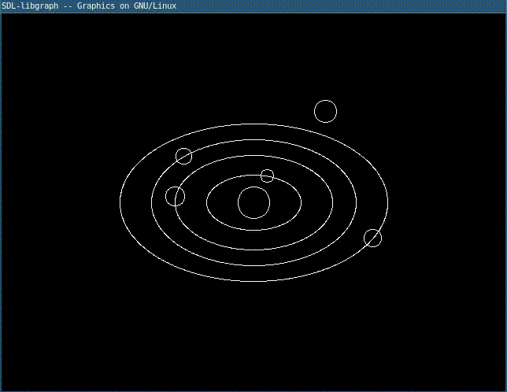

# Sistema Solar

1. `codigo.c`

	```c
	#include<graphics.h>
	#include<math.h>
	int main(){
	    // Set initial positions of planets
	    int m=0,
		v=260,
		eh=300,
		mr=100,
		j=10,
		s=230,
		u=190,
		n=20;
	    float pi=3.1424,a,b,c,d,e,f,g,h,z;
	    int gd=DETECT,gm;
	    initgraph(&gd,&gm,"");
	    /*animation*/
	    while(1){
		// Change the displacement
		a=(pi/180)*m++;
		b=(pi/180)*v++;
		c=(pi/180)*eh++;
		d=(pi/180)*mr++;
		e=(pi/180)*j++;
		f=(pi/180)*s++;
		g=(pi/180)*u++;
		h=(pi/180)*n++;
		n++;
		cleardevice();
		//Draw the Circle and ellipse
		//SUN
		circle(320,240,20);
		//Mercury
		circle(320+60*sin(a),240-35*cos(a),8);
		ellipse(320,240,0,360,60,35);
		//Venus
		circle(320+100*sin(b),240-60*cos(b),12);
		ellipse(320,240,0,360,100,60);
		//Earth
		circle(320+130*sin(c),240-80*cos(c),10);
		ellipse(320,240,0,360,130,80);
		//Mars
		circle(320+170*sin(d),240-100*cos(d),11);
		ellipse(320,240,0,360,170,100);
		//Jupiter
		circle(320+200*sin(e),240-130*cos(e),14);
		ellipse(320,240,0,360,200,130);
		//Saturn
		circle(320+230*sin(f),240-155*cos(f),12);
		ellipse(320,240,0,360,230,155);
		//Uranus
		circle(320+260*sin(g),240-180*cos(g),9);
		ellipse(320,240,0,360,260,180);
		//Neptune
		circle(320+280*sin(h),240-200*cos(h),9);
		ellipse(320,240,0,360,280,200);
		delay(50);
	    }
	    getch();
	}
	```

2. Compilar y ejecutar

	```sh
	$ gcc codigo.c -lgraph -lm
	```

3. Resultado

	
