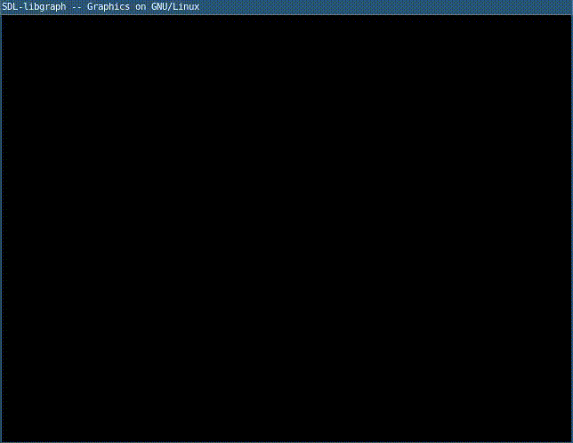

# Tree Fractal

1. `codigo.c`

	```c
	#include<math.h>
	#include<graphics.h>
	void drawTree(int x,int y,int length, int angle, int arg,int n){
		int x1,y1,l1;
		if(n>0){
		x1=(int)(x-length*sin(arg*M_PI/180));// x1 = x - length * sin(angle of tree)
		y1=(int)(y-length*cos(arg*M_PI/180));// y1 = y -  length * cos(angle pf tree)
		line(x,y,x1,y1);
		// Recursive function calls
		/*
		    call with
		    1. new x value. i.e. x1
		    2. new y value. i.e. y1
		    3. reduced length of bark
		    4. angle of barks
		    5. new angle of tree
		    6. reduced recursion level
		*/
		// RHS call
		drawTree(x1,y1,(int)(0.8*length),angle,arg+angle,n-1);
		// LHS call
		drawTree(x1,y1,(int)(0.8*length),angle,arg-angle,n-1);
		}
	}
	int main(){
		int gd=DETECT,gm,x,y,length,angle;
		initgraph(&gd, &gm,NULL);
		x=getmaxx()/2;
		y=getmaxy();
		length=100;         /* Length of the bark */
		angle=15;           /* Angle of barks */
		setcolor(GREEN);
		/*
		Call drawTree with
		    1. x position
		    2. y position
		    3. length of bark
		    4. Angle of deviation
		    5. angle of tree
		    6. level of recursion
		*/
		drawTree(x,y,length,angle,0,13);
		getch();
		return 0;
	}
	```

2. Compilar y ejecutar

	```sh
	$ gcc codigo.c -lgraph -lm
	$ ./a.out
	```

3. Resultado

	
