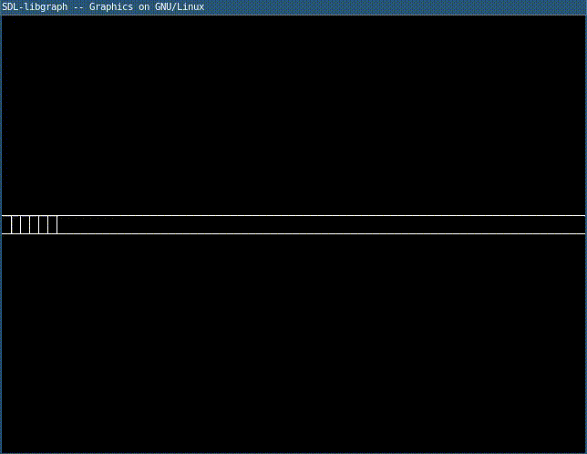

# Animación de tren

1. `codigo.c`

	```c
	#include <graphics.h>
	#include <math.h>
	void train(int x, int y){
	    float h = (float)getmaxy();
	    float w = (float)getmaxx();
	    line(0,h/2, w, h/2);
	    line(0,h/2 - 20, w, h/2 - 20);
	    int xx = 10;
	    while(xx < w){
		line(xx,h/2, xx, h/2-20);
		xx = xx+10;
	    }
	    circle(x+40, h/2 - 20,20);
	    //circle(x+50, h/2 - 20,20);
	    circle(x+150, h/2 - 20,20);
	    //circle(x+130, h/2 - 20,20);
	    //x = 50;
	    line(x, h/2-40, x, h/2-100);
	    line(x, h/2-100,x+200, h/2-100);
	    line(x+200, h/2-100, x+200, h/2-40);
	    line(x+200, h/2-40, x, h/2-40);
	    circle(x+160, h/2 - 70,10);
	}
	int main(){
	    int gd=DETECT,gm,x,y,length,angle;
	    initgraph(&gd, &gm, "");
	    int x1 = 100;                   //x-position of fish 1
	    int y1 = getmaxy()/2;      //y-position of fish 1
	    // Infinite Loop of swimming
	    while(x1<getmaxx()){
		//fish 1
		train(x1, y1);               //Draw that awesome fish
		x1+=3;                      // change the x position +3
		//y1+=rand()%11-5;            // change the y position with random value
		delay(50);
		cleardevice();
	    }
	    getch();
	    return 1;
	}
	```

2. Compilar y ejecutar

	```sh
	$ gcc codigo.c -lgraph
	$ ./a.out
	```

3. Resultado

	
